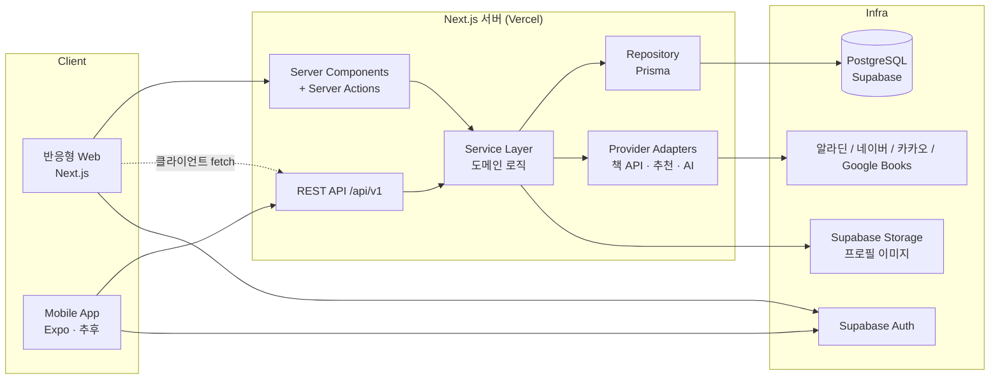
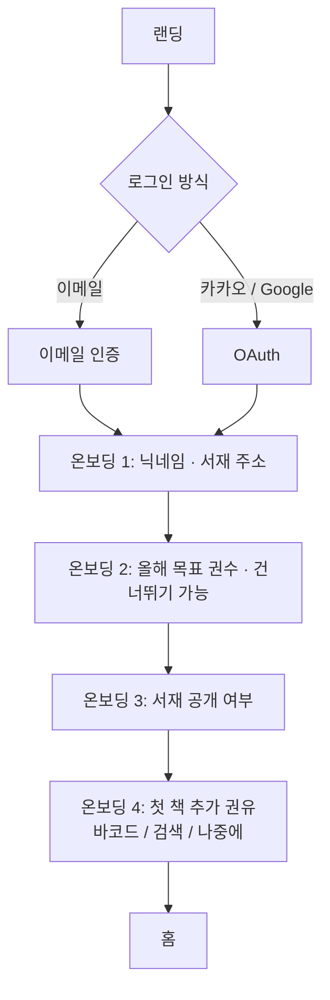
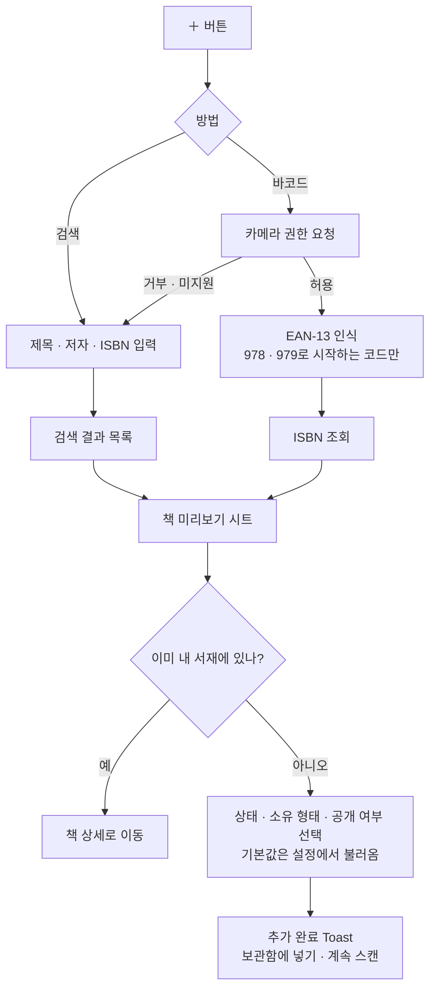
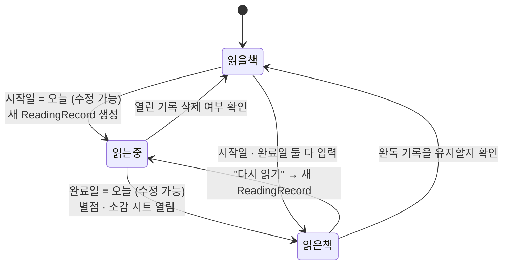
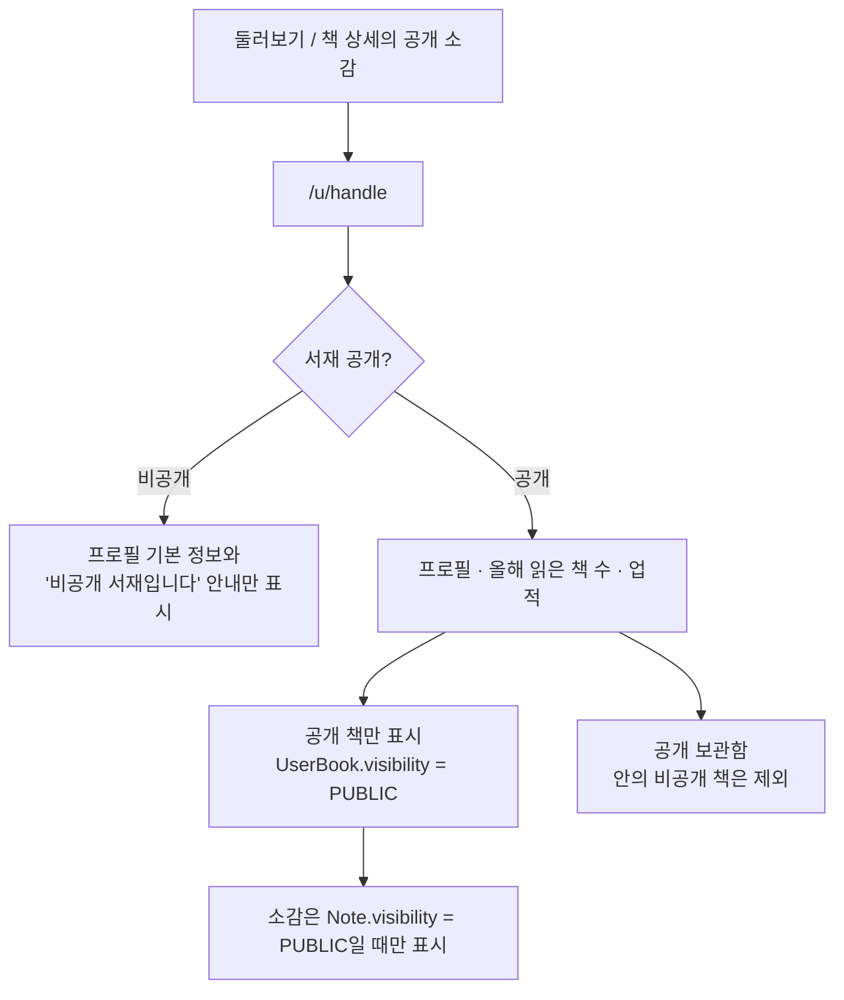
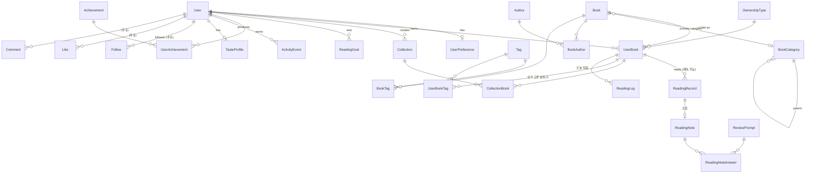

# Folio — 개인 독서 기록 · 공유 서비스 설계안

> 가칭 **Folio (폴리오)**. 이름은 확정 전입니다.
> 이 문서는 구현 전에 검토하기 위한 설계안입니다. 실제 코드는 아직 없습니다.

## 목차

0. [결정이 필요한 사항](#0-결정이-필요한-사항)
1. [전체 서비스 구조](#1-전체-서비스-구조)
2. [페이지 구조](#2-페이지-구조)
3. [사용자 Flow](#3-사용자-flow)
4. [기능 목록](#4-기능-목록)
5. [데이터베이스 ERD](#5-데이터베이스-erd)
6. [데이터 모델 (Prisma Schema 초안)](#6-데이터-모델)
7. [기술 스택과 선택 이유](#7-기술-스택)
8. [API 구조](#8-api-구조)
9. [폴더 구조](#9-폴더-구조)
10. [Phase별 구현 계획](#10-phase별-구현-계획)
11. [디자인 시스템](#11-디자인-시스템)

---

## 0. 결정이 필요한 사항

구현을 시작하기 전에 아래 항목을 확인해 주세요. 괄호 안은 제가 제안하는 기본값입니다.

| # | 항목 | 제안 |
|---|------|------|
| 1 | **배포 위치**: 이 저장소(`kimbany.github.io`)는 GitHub Pages(정적 호스팅)라 서버 기능(DB, 로그인, API Key 보호)을 실행할 수 없습니다. | 코드는 이 저장소의 `folio/` 폴더 또는 **별도 저장소**에 두고, 배포는 **Vercel + Supabase**로 합니다. 별도 저장소를 권장합니다. |
| 2 | 서비스 이름 / 도메인 | 가칭 Folio. `folio.invedory.com` 같은 서브도메인을 쓸 수 있습니다. |
| 3 | 로그인 방식 | 이메일+비밀번호, **카카오**, Google |
| 4 | 같은 책을 다시 읽은 경우 연간 권수 계산 | 완독 기록마다 1권으로 셉니다. 설정에서 "중복 제외"를 선택할 수 있게 합니다. |
| 5 | 책 API | **알라딘 Open API**를 기본으로 쓰고, 부족한 정보는 Google Books로 보완합니다. 알라딘은 상업적 이용 시 약관(출처 표기, 구매 링크)을 확인해야 합니다. |

---

## 1. 전체 서비스 구조



### 핵심 원칙

1. **Service Layer가 유일한 비즈니스 로직 위치입니다.**
   웹의 Server Action과 모바일용 REST API가 같은 Service 함수를 호출합니다. 그래서 모바일 앱을 붙일 때 API를 새로 만들 필요가 없습니다.
2. **외부 의존성은 Adapter로 감쌉니다.**
   책 API(`BookProvider`), 추천(`RecommendationProvider`), 취향 분석(`TasteAnalyzer`), 인사이트 문장 생성(`InsightGenerator`)은 모두 인터페이스 뒤에 두고 환경 변수로 구현체를 고릅니다. 규칙 기반 구현을 AI 구현으로 바꿔도 호출하는 쪽은 바뀌지 않습니다.
3. **순수 로직은 프레임워크와 분리합니다.**
   통계 계산, 업적 판정, 공개 범위 판정, 날짜 계산은 `packages/core`에 순수 함수로 둡니다. 웹과 모바일에서 같이 쓰고, 단위 테스트하기 쉽습니다.
4. **공개 범위는 한 곳에서만 판정합니다.**
   다른 사용자에게 보여줄 데이터는 반드시 `PublicLibraryService` → DB View(`v_public_user_books`, `v_public_notes`)를 거칩니다. 비공개 데이터가 새어 나갈 수 있는 경로를 하나로 줄이고, 그 경로를 테스트로 고정합니다.
5. **도메인 이벤트로 기능을 느슨하게 연결합니다.**
   `BOOK_FINISHED`, `RATING_SET`, `NOTE_WRITTEN` 같은 이벤트가 발생하면 업적 판정, 취향 프로필 갱신, 활동 기록(ActivityEvent)이 각각 반응합니다. 새 기능은 이벤트 구독자만 추가하면 됩니다.

### 요청 처리 예시 — "읽은 책으로 변경"

```
[UI] 상태 변경 버튼
  → Server Action: changeStatus(userBookId, READ, finishedAt)
    → LibraryService.changeStatus()
       ├ ReadingRecord 열린 기록에 finishedAt 기록 (없으면 새로 생성)
       ├ UserBook.status = READ
       └ emit BOOK_FINISHED
            ├ AchievementService.evaluate()  → 새 업적 반환
            ├ ActivityService.log()
            └ TasteService.markStale()
  ← { userBook, unlockedAchievements: [...] }
[UI] 기록 작성 시트 열기 + 업적 달성 Toast / Modal
```

---

## 2. 페이지 구조

### 2.1 라우트 맵

| 경로 | 화면 | 비고 |
|------|------|------|
| `/` | 랜딩 | 로그인 상태면 `/home`으로 이동 |
| `/login`, `/signup` | 로그인 / 회원가입 | |
| `/auth/callback` | 소셜 로그인 콜백 | |
| `/onboarding` | 닉네임 · 서재 주소(handle) · 올해 목표 · 공개 여부 | 첫 로그인 1회 |
| `/home` | **홈 대시보드** | |
| `/library` | 내 서재 (전체) | `?status=&genre=&ownership=&collection=&year=&rating=&q=&sort=` |
| `/library/want` · `/reading` · `/read` | 읽을 책 · 읽는 중 · 읽은 책 | `/library`의 필터 프리셋 |
| `/library/collections` | 내 보관함 목록 | |
| `/library/collections/[id]` | 보관함 상세 | |
| `/books/search` | 책 검색 (제목 · 저자 · ISBN) | 상단에 바코드 스캔 버튼 |
| `/books/scan` | ISBN 바코드 스캔 (전체 화면 카메라) | 모바일 |
| `/books/[bookId]` | **책 상세** | 내 기록, 다른 사용자의 공개 소감 |
| `/books/[bookId]/record` | 기록 작성 · 수정 | 모바일은 전체 화면, PC는 Intercepting Route로 모달 |
| `/calendar` | 연간 캘린더 | `?year=2026` |
| `/calendar/[year]/[month]` | 월간 캘린더 | 날짜 선택 시 Bottom Sheet |
| `/stats` | 독서 돌아보기 (통계) | `?year=` · 탭: 돌아보기 / 나의 취향 |
| `/stats/taste` | 나의 독서 취향 | |
| `/goals` | 연도별 목표와 기록 | |
| `/recommendations` | 추천 | 섹션별 |
| `/achievements` | 미션 · 업적 | 숨김 업적은 `???`로 표시 |
| `/explore` | 둘러보기 (공개 서재) | |
| `/u/[handle]` | 다른 사용자 서재 | 공개 데이터만 |
| `/u/[handle]/collections/[id]` | 다른 사용자의 공개 보관함 | |
| `/settings` | 프로필 · 공개 설정 · 계정 · 환경설정 | |

### 2.2 내비게이션

**PC / 태블릿 가로 (≥ 1024px)** — 왼쪽 사이드바 (접을 수 있음)

```
Folio
─────────────
홈
내 서재
  · 전체
  · 읽을 책
  · 읽는 중
  · 읽은 책
  · 내 보관함
캘린더
통계
추천
미션
둘러보기
─────────────
[+ 책 추가]
(프로필 사진) 닉네임 → 프로필 / 설정
```

**태블릿 세로 (768–1023px)** — 아이콘만 있는 좁은 사이드바

**모바일 (< 768px)** — 하단 탭 5개. 가운데는 책 추가 버튼입니다.

```
┌──────┬──────┬──────┬──────┬──────┐
│  홈  │ 서재 │  ＋  │ 기록 │  나  │
└──────┴──────┴──────┴──────┴──────┘
 ＋ → Bottom Sheet: [바코드 스캔] [제목 · 저자로 검색]
 기록 → 상단 탭: 캘린더 · 통계 · 취향
 나  → 프로필, 미션, 추천, 둘러보기, 목표, 설정
```

바코드 스캔은 모바일에서 두 번 탭하면 실행됩니다. 홈 화면에 추가(PWA)했을 때를 위해 앱 아이콘 길게 누르기 메뉴에 "바코드 스캔" 바로가기도 넣습니다.

### 2.3 주요 화면 구성

**홈 대시보드** (카드는 테두리 없이 여백과 배경 톤으로 구분)

```
┌───────────────────────────────────────────────┐
│ 올해 30권 중 18권을 읽었어요.                 │
│ ━━━━━━━━━━━━━━━━━━━░░░░░░░░░  60%             │
│ 목표까지 12권 · 이 속도면 12월 둘째 주에 달성 │
├───────────────────────────────────────────────┤
│ 지금 읽는 중                                  │
│ [표지 크게]  제목 / 저자 / 시작 9월 12일      │
│              [읽었어요] [오늘 읽음 체크]       │
├───────────────────────┬───────────────────────┤
│ 다음에 읽을 책        │ 최근 읽은 책          │
│ [표지][표지][표지] →  │ [표지][표지][표지] →  │
├───────────────────────┴───────────────────────┤
│ 월별 독서량 (작은 막대 12개)  │ 연속 독서 7일 │
├───────────────────────────────────────────────┤
│ 새로 얻은 업적 🏅 "벽돌책 정복자"             │
├───────────────────────────────────────────────┤
│ 이런 책은 어때요?  [표지][표지][표지][표지] → │
└───────────────────────────────────────────────┘
```

모바일에서는 한 열로 쌓고, 표지 목록은 가로 스크롤로 보여줍니다.

**책 상세**

```
[흐리게 처리한 표지 배경]
  [표지]   제목
           저자 · 출판사 · 출간일
           카테고리 · 320쪽
─────────────────────────────
내 기록 (내 서재에 있을 때)
  상태 [읽을 책 | 읽는 중 | 읽은 책]   소유 [종이책 ▾]
  2026.09.01 → 2026.09.14 (14일)
  ★★★★☆ 4.5
  "소감…"                      🔒 비공개
  보관함: 인생책 · 여름에 읽을 책  [+]
─────────────────────────────
책 소개 (접기 / 펼치기)
─────────────────────────────
이 책을 읽은 사람들 (공개 소감)
  (프로필) 닉네임 ★4.0  "…"
```

내 서재에 없는 책이면 "내 서재에 추가" 버튼을 보여줍니다.

---

## 3. 사용자 Flow

### 3.1 가입과 온보딩



### 3.2 책 추가



연속 스캔 모드에서는 추가한 뒤 카메라가 다시 켜집니다. 책장에 꽂힌 책을 한 번에 여러 권 등록할 때 씁니다.

### 3.3 상태 변경과 기록



- 날짜는 자동으로 채우되, 날짜 선택기로 언제든 고칠 수 있습니다.
- 시작일이 완료일보다 늦으면 저장하지 않고 안내합니다.
- 완독하면 기록 시트가 자동으로 열립니다. 별점과 소감은 모두 선택 사항이라 닫아도 됩니다.

### 3.4 소감 작성

```
★ ★ ★ ★ ☆   (반 칸 단위로 드래그 · 탭)

한 줄 소감
┌──────────────────────────────────┐
│                                  │
└──────────────────────────────────┘
💡 쓰기 막막하다면  [질문 보기 ▾]
   ○ 이 책은 무엇을 이야기하고 있나요?
   ○ 가장 기억에 남은 내용은 무엇이고, 왜 기억에 남았나요?
   ○ 공감하거나 동의하지 못한 부분이 있었나요?
   ○ 나의 경험이나 생각과 이어진 부분이 있었나요?
   ○ 다른 사람에게 소개한다면 어떻게 말하고 싶나요?
   (질문을 누르면 그 아래에 답변 칸이 열림)

이 책의 분위기 (선택)  #잔잔한 #철학적인 #성장 …
공개  ● 공개  ○ 비공개
```

### 3.5 다른 사용자 서재 방문



### 3.6 새해

1월 1일 이후 처음 로그인하면 홈 상단에 "2027년 목표를 정해볼까요?" 카드와 "2026년 돌아보기" 링크를 보여줍니다. 지난 연도 목표와 기록은 `/goals`와 `/stats?year=`에서 볼 수 있습니다.

---

## 4. 기능 목록

`P`는 구현 Phase입니다.

| 영역 | 기능 | P |
|------|------|---|
| 계정 | 이메일 가입 · 로그인, 카카오 · Google 로그인, 비밀번호 재설정 | 1 |
| | 온보딩 (닉네임, handle, 목표, 공개 여부) | 1 |
| | 프로필 편집 (이미지, 닉네임, 자기소개), 서재 공개 여부 | 1 |
| | 회원 탈퇴 (데이터 삭제), 내 데이터 내보내기 (CSV / JSON) | 6 |
| 책 | 제목 · 저자 · ISBN 검색 (Provider 체인) | 1 |
| | 책 미리보기 (표지, 제목, 저자, 출판사, 출간일, ISBN, 카테고리, 소개, 쪽수) | 1 |
| | 내 서재에 추가 (상태, 소유 형태, 공개 여부) | 1 |
| | 직접 등록 (API에 없는 책) | 2 |
| | ISBN 바코드 스캔, 연속 스캔 | 6 (구조는 1에서 준비) |
| 서재 | 상태별 목록, 그리드 · 리스트 보기 전환 | 2 |
| | 상태 변경 + 날짜 자동 입력 / 수정, 다시 읽기 | 2 |
| | 소유 형태 (종이책, 전자책, 대여, 미소유 + 확장) | 2 |
| | 책별 공개 여부 | 2 |
| | 검색 · 필터 (제목, 저자, 상태, 장르, 별점, 소유 형태, 보관함, 읽은 연도) | 2 |
| | 정렬 (최근 등록, 최근 완독, 제목, 별점 높은 순 · 낮은 순) | 2 |
| 보관함 | 생성, 이름 변경, 삭제, 책 추가 · 제거, 순서 변경, 공개 여부 | 2 |
| 기록 | 시작일 · 완료일, 0.5 단위 별점, 짧은 소감, 가이드 질문, 공개 여부 | 2 |
| | 분위기 태그 선택 | 2 |
| | "오늘 읽음" 체크 (연속 독서 계산용) | 3 |
| 목표 | 연도별 목표 설정 · 수정, 진행률 (막대 / 원형), 예상 달성일 | 3 |
| | 지난 연도 목표 · 달성 기록 | 3 |
| 홈 | 목표, 읽는 중, 다음 읽을 책, 최근 읽은 책, 최근 기록, 월별 독서량, 연속 독서, 새 업적, 추천 | 3 (추천은 4, 업적은 5) |
| 캘린더 | 연간 (월별 권수, 표지 모아보기), 월간 (완료일에 표지), 날짜별 완독 목록 | 3 |
| 통계 | 기본: 올해 권수, 달성률, 월별 권수, 장르 · 작가 · 출판사, 소유 형태 비율, 평균 별점, 별점 분포 | 3 |
| | 고급: 총 쪽수, 월평균, 평균 독서 기간, 가장 빨리 · 오래 읽은 책, 작년 대비 | 4 |
| | 데이터 기반 인사이트 문장 | 3 (기본) / 4 (전체) |
| 취향 | 장르 · 작가 (많이 읽음 / 높게 평가), 키워드, 분위기, 취향 요약 문장 | 4 |
| 추천 | 비슷한 책, 자주 읽는 장르, 좋아하는 작가의 다른 작품, 새로운 장르, 관심 보관함 기반 | 4 |
| 업적 | 데이터 기반 업적 정의, 숨김 업적, 달성 Toast / Modal, 프로필 업적 목록 | 5 |
| 공유 | 공개 서재, 둘러보기, 책 상세의 공개 소감 | 5 |
| | 팔로우 · 좋아요 · 댓글 (테이블만 준비, 기능은 추후) | 추후 |
| 품질 | PWA, 이미지 최적화, 다크 모드, 접근성, 성능 | 6 |

---

## 5. 데이터베이스 ERD



### 테이블 역할 요약

| 테이블 | 역할 |
|--------|------|
| **User** | 프로필. `id`는 Supabase Auth의 `auth.users.id`와 같은 값 |
| **UserPreference** | 기본 공개 여부, 기본 소유 형태, 질문 가이드 표시, 재독 집계 방식, 테마 등 |
| **Book** | API에서 가져온 공통 책 정보. ISBN-13으로 중복 제거. 모든 사용자가 공유 |
| **Author / BookAuthor** | 저자를 정규화하고 역할(지은이, 옮긴이, 그림 등)을 구분. 작가 통계는 지은이만 집계 |
| **BookCategory** | API의 공식 카테고리 트리. `genre` 컬럼에 서비스 자체 장르(소설, 에세이, 인문 …)를 매핑 |
| **Tag / BookTag** | 책의 키워드와 분위기. 출처(SYSTEM / AI / API)와 신뢰도를 저장 |
| **UserBookTag** | 사용자가 직접 고른 분위기 태그. 취향 분석의 주 입력 |
| **UserBook** ⭐ | 핵심 관계 테이블. 사용자 × 책. 상태, 소유 형태, 공개 여부, 등록일, 현재 쪽수 |
| **OwnershipType** | 소유 형태 목록 (PAPER, EBOOK, RENTAL, NONE, 추후 AUDIOBOOK, LIBRARY …). DB 마이그레이션 없이 값만 추가 가능 |
| **ReadingRecord** | 한 번의 읽기. 시작일, 완료일, 별점. 재독하면 기록이 여러 개 생김 |
| **ReadingNote** | 소감 본문과 공개 여부. 기록 하나에 소감 하나 |
| **ReviewPrompt / ReadingNoteAnswer** | 가이드 질문과 그 답변 |
| **ReadingLog** | "오늘 읽음" 체크. 연속 독서와 활동 기록에 사용 |
| **Collection / CollectionBook** | 개인 보관함. `CollectionBook`은 `bookId`가 아니라 `userBookId`를 참조해서 내 서재의 책만 담기도록 보장 |
| **ReadingGoal** | 연도별 목표 권수. `(userId, year)` 유일 |
| **Achievement** | 업적 정의. 조건은 `criteria` JSON으로 저장 |
| **UserAchievement** | 획득 기록. `seenAt`이 비어 있으면 "새 업적" |
| **ActivityEvent** | 활동 로그. 홈의 "최근 독서 기록", 추후 팔로우 피드의 원천 |
| **TasteProfile** | 계산된 취향 결과 캐시. `source`로 규칙 기반 / AI 구분 |
| **RecommendationSnapshot** | 추천 결과 캐시. 외부 API 호출 횟수를 줄임 |
| **Follow / Like / Comment** | 추후 소셜 기능. 대상은 `targetType + targetId`로 여러 종류를 받음 |

### 공개 범위 규칙

다른 사용자에게 보이는 조건은 세 단계가 **모두** 공개일 때만 성립합니다.

| 대상 | 조건 |
|------|------|
| 책 | `User.libraryVisibility = PUBLIC` AND `UserBook.visibility = PUBLIC` |
| 소감 | 위 조건 AND `ReadingNote.visibility = PUBLIC` |
| 보관함 | `User.libraryVisibility = PUBLIC` AND `Collection.visibility = PUBLIC`, 그 안에서도 공개 책만 |
| 별점 | 책이 공개면 공개 (소감과 별개) |

이 규칙은 DB View로 만들고, 공개 조회용 Repository는 View만 읽습니다. "비공개 책을 만든 뒤 다른 계정으로 조회하면 절대 나오지 않는다"를 통합 테스트로 고정합니다.

---

## 6. 데이터 모델

Prisma Schema 초안입니다. 날짜(시작일, 완료일)는 시간대 때문에 날짜가 하루 밀리는 문제를 피하려고 `@db.Date`로 저장하고, 서비스 기준 시간대는 `Asia/Seoul`로 둡니다.

```prisma
// packages/db/prisma/schema.prisma

generator client {
  provider = "prisma-client-js"
}

datasource db {
  provider  = "postgresql"
  url       = env("DATABASE_URL")
  directUrl = env("DIRECT_URL")
}

// ───────── Enums (값이 바뀔 일이 거의 없는 것만 enum으로) ─────────

enum ReadingStatus {
  WANT_TO_READ // 읽을 책
  READING      // 읽는 중
  READ         // 읽은 책
}

enum Visibility {
  PUBLIC
  PRIVATE
}

enum RecordState {
  IN_PROGRESS
  FINISHED
  ABANDONED // 중단 (추후 "읽다 만 책" 기능)
}

enum AuthorRole {
  AUTHOR
  TRANSLATOR
  ILLUSTRATOR
  EDITOR
  OTHER
}

enum TagType {
  MOOD    // 잔잔한, 어두운, 유쾌한 …
  THEME   // 성장, 사회 문제, 로맨스 …
  KEYWORD // 책 자체의 키워드
}

enum TagSource {
  API
  SYSTEM
  AI
}

enum TargetType {
  USER_BOOK
  READING_NOTE
  COLLECTION
}

// ───────── User ─────────

model User {
  id                String     @id @db.Uuid // = auth.users.id
  email             String     @unique
  handle            String     @unique // 서재 주소 /u/{handle}
  nickname          String
  bio               String?    @db.VarChar(300)
  avatarUrl         String?
  libraryVisibility Visibility @default(PRIVATE)
  createdAt         DateTime   @default(now())
  updatedAt         DateTime   @updatedAt
  deletedAt         DateTime?

  preference   UserPreference?
  userBooks    UserBook[]
  collections  Collection[]
  goals        ReadingGoal[]
  achievements UserAchievement[]
  activities   ActivityEvent[]
  tasteProfile TasteProfile?
  following    Follow[]  @relation("follower")
  followers    Follow[]  @relation("followee")
  likes        Like[]
  comments     Comment[]
}

model UserPreference {
  userId                  String     @id @db.Uuid
  defaultBookVisibility   Visibility @default(PUBLIC)
  defaultNoteVisibility   Visibility @default(PRIVATE)
  defaultOwnershipCode    String     @default("PAPER")
  showNotePrompts         Boolean    @default(true)
  countRereadsInYearTotal Boolean    @default(true)
  theme                   String     @default("system") // light | dark | system
  extra                   Json       @default("{}")     // 스키마 변경 없이 설정 추가

  user User @relation(fields: [userId], references: [id], onDelete: Cascade)
}

// ───────── Book (공통 책 정보) ─────────

model Book {
  id            String    @id @default(cuid())
  isbn13        String?   @unique
  isbn10        String?
  title         String
  subtitle      String?
  publisher     String?
  publishedDate DateTime? @db.Date
  description   String?
  coverUrl      String?
  pageCount     Int?
  language      String?   @default("ko")
  categoryId    String?
  source        String    // aladin | naver | kakao | google | manual
  sourceId      String?   // 원본 API의 상품 ID
  raw           Json?     // 원본 응답 (재가공용)
  createdById   String?   @db.Uuid // manual 등록자
  createdAt     DateTime  @default(now())
  updatedAt     DateTime  @updatedAt

  category  BookCategory? @relation(fields: [categoryId], references: [id])
  authors   BookAuthor[]
  tags      BookTag[]
  userBooks UserBook[]

  @@unique([source, sourceId])
  @@index([title])
}

model Author {
  id    String       @id @default(cuid())
  name  String       @unique // 정규화된 이름
  books BookAuthor[]
}

model BookAuthor {
  bookId   String
  authorId String
  role     AuthorRole @default(AUTHOR)
  position Int        @default(0)

  book   Book   @relation(fields: [bookId], references: [id], onDelete: Cascade)
  author Author @relation(fields: [authorId], references: [id])

  @@id([bookId, authorId, role])
  @@index([authorId])
}

model BookCategory {
  id         String  @id @default(cuid())
  source     String  // aladin | google
  externalId String
  name       String  // "일본소설"
  path       String  // "국내도서>소설/시/희곡>일본소설"
  parentId   String?
  genre      String? // 서비스 자체 장르 키: novel, essay, humanities …

  parent   BookCategory?  @relation("CategoryTree", fields: [parentId], references: [id])
  children BookCategory[] @relation("CategoryTree")
  books    Book[]

  @@unique([source, externalId])
  @@index([genre])
}

model Tag {
  id    String  @id @default(cuid())
  slug  String  @unique // calm, philosophical, fast-paced …
  name  String  // 잔잔한
  type  TagType

  books     BookTag[]
  userBooks UserBookTag[]
}

model BookTag {
  bookId     String
  tagId      String
  source     TagSource
  confidence Float     @default(1)

  book Book @relation(fields: [bookId], references: [id], onDelete: Cascade)
  tag  Tag  @relation(fields: [tagId], references: [id], onDelete: Cascade)

  @@id([bookId, tagId, source])
}

// ───────── UserBook (핵심 관계) ─────────

model OwnershipType {
  code      String  @id // PAPER | EBOOK | RENTAL | NONE | …
  label     String  // 종이책
  sortOrder Int     @default(0)
  active    Boolean @default(true)

  userBooks UserBook[]
}

model UserBook {
  id            String        @id @default(cuid())
  userId        String        @db.Uuid
  bookId        String
  status        ReadingStatus @default(WANT_TO_READ)
  ownershipCode String        @default("NONE")
  visibility    Visibility    @default(PUBLIC)
  currentPage   Int?
  addedAt       DateTime      @default(now())
  statusChangedAt DateTime    @default(now())
  updatedAt     DateTime      @updatedAt

  user        User             @relation(fields: [userId], references: [id], onDelete: Cascade)
  book        Book             @relation(fields: [bookId], references: [id])
  ownership   OwnershipType    @relation(fields: [ownershipCode], references: [code])
  records     ReadingRecord[]
  collections CollectionBook[]
  moodTags    UserBookTag[]
  logs        ReadingLog[]

  @@unique([userId, bookId])
  @@index([userId, status])
  @@index([userId, addedAt])
}

model UserBookTag {
  userBookId String
  tagId      String

  userBook UserBook @relation(fields: [userBookId], references: [id], onDelete: Cascade)
  tag      Tag      @relation(fields: [tagId], references: [id])

  @@id([userBookId, tagId])
}

// ───────── 기록 ─────────

model ReadingRecord {
  id         String      @id @default(cuid())
  userBookId String
  state      RecordState @default(IN_PROGRESS)
  startedAt  DateTime?   @db.Date
  finishedAt DateTime?   @db.Date
  rating     Decimal?    @db.Decimal(2, 1) // 0.5 ~ 5.0, CHECK 제약으로 0.5 단위 강제
  createdAt  DateTime    @default(now())
  updatedAt  DateTime    @updatedAt

  userBook UserBook     @relation(fields: [userBookId], references: [id], onDelete: Cascade)
  note     ReadingNote?

  @@index([userBookId])
  @@index([finishedAt])
}

model ReadingNote {
  id              String     @id @default(cuid())
  readingRecordId String     @unique
  content         String?    @db.VarChar(2000) // 짧은 소감이 기본
  visibility      Visibility @default(PRIVATE)
  createdAt       DateTime   @default(now())
  updatedAt       DateTime   @updatedAt

  record  ReadingRecord       @relation(fields: [readingRecordId], references: [id], onDelete: Cascade)
  answers ReadingNoteAnswer[]
}

model ReviewPrompt {
  id        String  @id @default(cuid())
  text      String
  sortOrder Int
  active    Boolean @default(true)

  answers ReadingNoteAnswer[]
}

model ReadingNoteAnswer {
  noteId   String
  promptId String
  answer   String @db.VarChar(1000)

  note   ReadingNote  @relation(fields: [noteId], references: [id], onDelete: Cascade)
  prompt ReviewPrompt @relation(fields: [promptId], references: [id])

  @@id([noteId, promptId])
}

model ReadingLog {
  id         String   @id @default(cuid())
  userBookId String
  date       DateTime @db.Date
  pageFrom   Int?
  pageTo     Int?

  userBook UserBook @relation(fields: [userBookId], references: [id], onDelete: Cascade)

  @@unique([userBookId, date])
}

// ───────── 보관함 ─────────

model Collection {
  id          String     @id @default(cuid())
  userId      String     @db.Uuid
  name        String     @db.VarChar(40)
  description String?    @db.VarChar(200)
  visibility  Visibility @default(PUBLIC)
  sortOrder   Int        @default(0)
  createdAt   DateTime   @default(now())
  updatedAt   DateTime   @updatedAt

  user  User             @relation(fields: [userId], references: [id], onDelete: Cascade)
  books CollectionBook[]

  @@unique([userId, name])
}

model CollectionBook {
  collectionId String
  userBookId   String
  position     Int      @default(0)
  addedAt      DateTime @default(now())

  collection Collection @relation(fields: [collectionId], references: [id], onDelete: Cascade)
  userBook   UserBook   @relation(fields: [userBookId], references: [id], onDelete: Cascade)

  @@id([collectionId, userBookId])
}

// ───────── 목표 · 업적 ─────────

model ReadingGoal {
  id          String   @id @default(cuid())
  userId      String   @db.Uuid
  year        Int
  targetCount Int
  createdAt   DateTime @default(now())
  updatedAt   DateTime @updatedAt

  user User @relation(fields: [userId], references: [id], onDelete: Cascade)

  @@unique([userId, year])
}

model Achievement {
  id          String  @id @default(cuid())
  code        String  @unique // FIRST_BOOK, BOOKWORM_10 …
  title       String
  description String  // 달성 후 보이는 설명
  hint        String? // 숨김 업적의 달성 전 힌트 ("여름과 관련 있어요")
  isHidden    Boolean @default(false)
  icon        String
  category    String  // count | genre | author | season | rating | page …
  criteria    Json    // { "type": "finished_count", "gte": 10 }
  sortOrder   Int     @default(0)
  active      Boolean @default(true)

  users UserAchievement[]
}

model UserAchievement {
  userId        String    @db.Uuid
  achievementId String
  unlockedAt    DateTime  @default(now())
  seenAt        DateTime?
  context       Json?     // 달성의 계기가 된 책 등

  user        User        @relation(fields: [userId], references: [id], onDelete: Cascade)
  achievement Achievement @relation(fields: [achievementId], references: [id])

  @@id([userId, achievementId])
}

// ───────── 활동 · 분석 캐시 ─────────

model ActivityEvent {
  id         String     @id @default(cuid())
  userId     String     @db.Uuid
  type       String     // BOOK_ADDED | STATUS_CHANGED | BOOK_FINISHED | NOTE_WRITTEN | ACHIEVEMENT_UNLOCKED
  subjectId  String?    // userBookId 등
  payload    Json       @default("{}")
  visibility Visibility @default(PRIVATE)
  createdAt  DateTime   @default(now())

  user User @relation(fields: [userId], references: [id], onDelete: Cascade)

  @@index([userId, createdAt])
}

model TasteProfile {
  userId     String   @id @db.Uuid
  source     String   // rule | ai
  version    Int      @default(1)
  data       Json     // 장르 · 작가 · 분위기 · 키워드 점수
  summary    String?  // "잔잔하고 사색적인 일본 소설을 좋아하는 독자"
  stale      Boolean  @default(false)
  computedAt DateTime @default(now())

  user User @relation(fields: [userId], references: [id], onDelete: Cascade)
}

model RecommendationSnapshot {
  id          String   @id @default(cuid())
  userId      String   @db.Uuid
  section     String   // similar_recent | top_genre | favorite_author | new_genre | from_collection
  provider    String   // rule-v1 | ai-v1
  items       Json     // [{ isbn13, reason, score }]
  generatedAt DateTime @default(now())
  expiresAt   DateTime

  @@unique([userId, section])
}

// ───────── 소셜 (추후) ─────────

model Follow {
  followerId String   @db.Uuid
  followeeId String   @db.Uuid
  createdAt  DateTime @default(now())

  follower User @relation("follower", fields: [followerId], references: [id], onDelete: Cascade)
  followee User @relation("followee", fields: [followeeId], references: [id], onDelete: Cascade)

  @@id([followerId, followeeId])
}

model Like {
  userId     String     @db.Uuid
  targetType TargetType
  targetId   String
  createdAt  DateTime   @default(now())

  user User @relation(fields: [userId], references: [id], onDelete: Cascade)

  @@id([userId, targetType, targetId])
  @@index([targetType, targetId])
}

model Comment {
  id         String     @id @default(cuid())
  userId     String     @db.Uuid
  targetType TargetType
  targetId   String
  content    String     @db.VarChar(500)
  createdAt  DateTime   @default(now())
  deletedAt  DateTime?

  user User @relation(fields: [userId], references: [id], onDelete: Cascade)

  @@index([targetType, targetId])
}
```

### 스키마 밖에서 추가할 것 (SQL 마이그레이션)

```sql
-- 별점 0.5 단위
ALTER TABLE "ReadingRecord" ADD CONSTRAINT rating_half_step
  CHECK (rating IS NULL OR (rating BETWEEN 0.5 AND 5.0 AND rating * 2 = floor(rating * 2)));

-- 시작일 ≤ 완료일
ALTER TABLE "ReadingRecord" ADD CONSTRAINT record_date_order
  CHECK ("startedAt" IS NULL OR "finishedAt" IS NULL OR "startedAt" <= "finishedAt");

-- 공개 책만 보이는 View
CREATE VIEW v_public_user_books AS
SELECT ub.*
FROM "UserBook" ub
JOIN "User" u ON u.id = ub."userId"
WHERE u."libraryVisibility" = 'PUBLIC'
  AND ub.visibility = 'PUBLIC'
  AND u."deletedAt" IS NULL;

-- 공개 소감만 보이는 View
CREATE VIEW v_public_notes AS
SELECT n.*, r."userBookId", r.rating, r."finishedAt"
FROM "ReadingNote" n
JOIN "ReadingRecord" r ON r.id = n."readingRecordId"
JOIN v_public_user_books pub ON pub.id = r."userBookId"
WHERE n.visibility = 'PUBLIC';
```

Supabase의 Row Level Security도 켜서, 혹시 클라이언트가 DB에 직접 접근하더라도 본인 데이터만 보이도록 이중으로 막습니다.

### 연간 권수 계산 기준

```
해당 연도 완독 수 =
  ReadingRecord where state = FINISHED
                  and finishedAt ∈ [YYYY-01-01, YYYY-12-31]
                  and userBook.userId = me
  (UserPreference.countRereadsInYearTotal = false 이면 bookId 기준 중복 제거)
```

---

## 7. 기술 스택

| 영역 | 선택 | 이유 |
|------|------|------|
| 모노레포 | **pnpm workspace + Turborepo** | 웹과 추후 모바일 앱이 타입, 검증 스키마, 도메인 로직을 공유합니다. 처음부터 나눠 두면 모바일 앱을 붙일 때 코드를 옮길 필요가 없습니다. |
| 프레임워크 | **Next.js (App Router, 최신 안정 버전)** | 서버 컴포넌트로 표지가 많은 화면을 빠르게 그리고, Server Action과 Route Handler로 백엔드를 한 프로젝트에서 운영할 수 있습니다. 1인 개발에서 배포와 운영 부담이 가장 적습니다. |
| 언어 | **TypeScript (strict)** | DB부터 UI, 모바일까지 타입이 이어집니다. |
| 스타일 | **Tailwind CSS v4 + CSS 변수 디자인 토큰** | 반응형을 빠르게 만들 수 있고, 토큰으로 라이트 · 다크 테마와 추후 모바일(NativeWind) 스타일을 맞추기 쉽습니다. |
| UI 기본 컴포넌트 | **shadcn/ui (Radix 기반)** | 접근성이 갖춰진 Dialog, Sheet, Popover 등을 가져와 직접 수정합니다. 라이브러리 기본 모양이 드러나지 않게 디자인을 입힙니다. |
| 모바일 시트 | **Vaul** (Drawer) | 모바일 Bottom Sheet의 자연스러운 드래그 동작 |
| 애니메이션 | **Motion** (최소한으로) | 업적 달성, 표지 전환 등 꼭 필요한 곳에만 |
| 차트 | **직접 만든 SVG 컴포넌트 + visx 일부** | 관리자 대시보드 느낌을 피하려면 기본 차트 모양을 쓰기보다 직접 그리는 편이 낫습니다. 막대, 도넛, 캘린더 히트맵 정도라 부담이 크지 않습니다. |
| 서버 상태 (클라이언트) | **TanStack Query** | 필터, 무한 스크롤, 낙관적 업데이트 (상태 변경 즉시 반영) |
| 검증 | **Zod** | API 입력 검증 스키마를 `packages/core`에 두고 웹 폼, API, 모바일이 함께 씁니다. |
| DB | **PostgreSQL (Supabase)** | 통계용 집계 쿼리, View, CHECK 제약, JSONB를 모두 지원합니다. |
| ORM | **Prisma** | 스키마 파일이 곧 문서 역할을 하고, 마이그레이션 관리가 편합니다. 복잡한 통계 쿼리는 `$queryRaw`(타입 지정 SQL)로 작성합니다. |
| 인증 | **Supabase Auth** | 카카오 로그인을 기본 지원합니다. JWT 기반이라 모바일 앱(Expo)에서도 같은 계정으로 바로 로그인할 수 있습니다. NextAuth(Auth.js)는 웹 쿠키 세션 중심이라 모바일 확장 시 별도 작업이 필요합니다. |
| 파일 저장 | **Supabase Storage** | 프로필 이미지, 직접 등록한 책 표지 |
| 책 API | **알라딘 Open API (기본) → Google Books (보완)**, 네이버 · 카카오는 교체 가능한 Adapter로 준비 | 아래 비교표 참고 |
| 바코드 | **BarcodeDetector API + `barcode-detector` 폴리필 (ZXing WASM)** | Android Chrome은 기본 API를 쓰고, iOS Safari처럼 지원하지 않는 브라우저는 폴리필로 같은 코드가 동작합니다. |
| 캐시 | Next.js 데이터 캐시 → 필요할 때 **Upstash Redis** | 검색 결과와 추천 결과 캐시. 처음에는 DB 캐시 테이블로 충분합니다. |
| 테스트 | **Vitest** (도메인 로직), **Playwright** (주요 흐름 E2E) | 업적 판정, 통계, 공개 범위는 반드시 단위 테스트 |
| 배포 | **Vercel** (웹) + **Supabase** (DB · Auth · Storage) | 무료 구간으로 시작할 수 있고, 관리할 서버가 없습니다. |
| 모니터링 | Sentry, Vercel Analytics | |

### 책 API 비교

| | 알라딘 | 네이버 | 카카오 | Google Books |
|---|---|---|---|---|
| 한국 도서 정확도 | 매우 좋음 | 좋음 | 좋음 | 보통 |
| 표지 품질 | 큼 (Cover=Big) | 보통 | 보통 | 작음 |
| **쪽수** | ✅ (상품 조회 API) | ❌ | ❌ | ✅ |
| **카테고리** | ✅ 한국어 트리 | ❌ | ❌ | 영어 |
| ISBN 조회 | ✅ | ✅ | ✅ | ✅ |
| 카테고리별 목록 · 베스트셀러 | ✅ (추천에 사용) | ❌ | ❌ | ❌ |
| 키 | TTBKey | Client ID/Secret | REST Key | API Key (선택) |

요구사항의 필수 항목(쪽수, 카테고리)을 한 번에 채울 수 있는 곳은 알라딘뿐이라 기본 Provider로 정합니다. 검색 API 결과에는 쪽수가 없어서, 사용자가 책을 고르는 순간 상품 조회 API(ItemLookUp)를 한 번 더 호출해 상세 정보를 채웁니다. 알라딘 결과가 없으면 Google Books, 그다음 카카오 순으로 시도합니다(`BOOK_PROVIDERS=aladin,google,kakao`).

### 환경 변수 (`.env.example`만 커밋, `.env`는 `.gitignore`)

```bash
# App
NEXT_PUBLIC_APP_URL=http://localhost:3000
APP_TIMEZONE=Asia/Seoul

# Database (Supabase)
DATABASE_URL=            # pooled (pgbouncer)
DIRECT_URL=              # migration용 direct

# Supabase
NEXT_PUBLIC_SUPABASE_URL=
NEXT_PUBLIC_SUPABASE_ANON_KEY=
SUPABASE_SERVICE_ROLE_KEY=   # 서버 전용, 절대 NEXT_PUBLIC_ 금지

# Book providers
BOOK_PROVIDERS=aladin,google,kakao
ALADIN_TTB_KEY=
NAVER_CLIENT_ID=
NAVER_CLIENT_SECRET=
KAKAO_REST_API_KEY=
GOOGLE_BOOKS_API_KEY=

# Recommendation / AI (추후)
RECOMMENDATION_PROVIDER=rule   # rule | ai
TASTE_ANALYZER=rule            # rule | ai
AI_API_KEY=
```

환경 변수는 `packages/core/env.ts`에서 Zod로 검증해서, 빠진 값이 있으면 앱 시작 시점에 바로 에러가 나도록 합니다.

---

## 8. API 구조

### 8.1 계층

```
Route Handler (/api/v1/*)  ─┐
Server Action (웹 폼)       ─┼→ Service → Repository → Prisma
Server Component (조회)     ─┘      └→ Provider (외부 API)
```

- **Route Handler / Server Action**: 인증 확인, Zod 입력 검증, Service 호출, 응답 변환만 합니다. 로직을 두지 않습니다.
- **Service**: 도메인 규칙, 트랜잭션, 이벤트 발행.
- **Repository**: Prisma 쿼리만 담당합니다. 공개 조회용 `PublicRepository`는 View만 읽습니다.
- **Provider**: 외부 API 호출과 응답 정규화.

### 8.2 응답 형식

```ts
// 성공
{ "data": { ... }, "meta": { "nextCursor": "..." }, "events": { "achievementsUnlocked": [ ... ] } }
// 실패
{ "error": { "code": "VALIDATION_ERROR", "message": "시작일이 완료일보다 늦어요.", "fields": { ... } } }
```

`events`는 상태를 바꾸는 요청에만 붙습니다. 클라이언트는 이 값을 보고 업적 Toast를 띄우므로, 웹과 모바일이 같은 방식으로 처리합니다.

### 8.3 엔드포인트

인증: 웹은 Supabase 쿠키 세션, 모바일은 `Authorization: Bearer <Supabase JWT>`. 둘 다 같은 `getCurrentUser()`로 처리합니다.

**계정**

| Method | Path | 설명 |
|---|---|---|
| GET | `/api/v1/me` | 내 프로필 + 올해 목표 요약 |
| PATCH | `/api/v1/me` | 닉네임, 자기소개, 이미지, 서재 공개 여부 |
| GET / PATCH | `/api/v1/me/preferences` | 환경설정 |
| GET | `/api/v1/handles/{handle}/availability` | 서재 주소 중복 확인 |

**책 (공통 정보)**

| Method | Path | 설명 |
|---|---|---|
| GET | `/api/v1/books/search?q=&type=title\|author\|isbn\|all&page=` | 외부 API 검색 (내 서재 포함 여부 표시) |
| GET | `/api/v1/books/isbn/{isbn}` | ISBN 조회 (바코드 스캔 결과) |
| POST | `/api/v1/books/resolve` | 검색 결과 후보 → DB의 Book으로 저장 (상세 보완 포함), `bookId` 반환 |
| POST | `/api/v1/books/manual` | 직접 등록 |
| GET | `/api/v1/books/{bookId}` | 책 상세 (+ 내 UserBook이 있으면 함께) |
| GET | `/api/v1/books/{bookId}/notes?cursor=` | 다른 사용자의 공개 소감 |

**내 서재**

| Method | Path | 설명 |
|---|---|---|
| GET | `/api/v1/library?status=&genre=&ownership=&collectionId=&year=&minRating=&maxRating=&q=&sort=recent_added\|recent_finished\|title\|rating_desc\|rating_asc&cursor=` | 검색 · 필터 · 정렬 |
| POST | `/api/v1/library` | 추가 `{ bookId, status, ownershipCode, visibility, startedAt?, finishedAt? }` |
| GET | `/api/v1/library/{userBookId}` | 상세 (기록, 소감, 보관함 포함) |
| PATCH | `/api/v1/library/{userBookId}` | 소유 형태, 공개 여부, 현재 쪽수 |
| POST | `/api/v1/library/{userBookId}/status` | 상태 전환 `{ status, date? }` → 기록 자동 처리 + `events` |
| DELETE | `/api/v1/library/{userBookId}` | 서재에서 삭제 |
| GET | `/api/v1/library/{userBookId}/records` | 읽기 기록 목록 (재독) |
| PATCH | `/api/v1/records/{recordId}` | 시작일, 완료일, 별점 |
| DELETE | `/api/v1/records/{recordId}` | 기록 삭제 |
| PUT | `/api/v1/records/{recordId}/note` | 소감 + 질문 답변 + 공개 여부 |
| PUT | `/api/v1/library/{userBookId}/moods` | 분위기 태그 |
| POST | `/api/v1/library/{userBookId}/logs` | 오늘 읽음 체크 |
| GET | `/api/v1/review-prompts` | 가이드 질문 |
| GET | `/api/v1/ownership-types` | 소유 형태 목록 |
| GET | `/api/v1/tags?type=mood` | 분위기 태그 목록 |

**보관함**

| Method | Path | 설명 |
|---|---|---|
| GET / POST | `/api/v1/collections` | 목록 / 생성 |
| GET / PATCH / DELETE | `/api/v1/collections/{id}` | 상세 / 이름 · 설명 · 공개 여부 변경 / 삭제 |
| POST | `/api/v1/collections/{id}/books` | 책 추가 `{ userBookIds: [] }` |
| DELETE | `/api/v1/collections/{id}/books/{userBookId}` | 책 제거 |
| PUT | `/api/v1/collections/{id}/order` | 순서 변경 |
| PUT | `/api/v1/library/{userBookId}/collections` | 한 책이 속한 보관함을 한 번에 지정 |

**목표 · 통계 · 캘린더 · 취향 · 추천**

| Method | Path | 설명 |
|---|---|---|
| GET | `/api/v1/goals` | 전체 연도 목표와 달성 결과 |
| PUT | `/api/v1/goals/{year}` | 목표 설정 · 수정 |
| GET | `/api/v1/dashboard` | 홈 화면에 필요한 데이터를 한 번에 |
| GET | `/api/v1/stats?year=` | 통계 (기본 + 고급) |
| GET | `/api/v1/stats/insights?year=` | 인사이트 문장 |
| GET | `/api/v1/calendar/{year}` | 월별 권수와 표지 |
| GET | `/api/v1/calendar/{year}/{month}` | 날짜별 완독 책 |
| GET | `/api/v1/streak` | 연속 독서 |
| GET | `/api/v1/taste` | 취향 프로필 (오래됐으면 다시 계산) |
| GET | `/api/v1/recommendations?section=` | 추천 섹션 |
| POST | `/api/v1/recommendations/feedback` | "관심 없음" (추후 학습용) |

**업적**

| Method | Path | 설명 |
|---|---|---|
| GET | `/api/v1/achievements` | 전체 목록. 달성 전 숨김 업적은 `title: "???"`와 `hint`만 |
| POST | `/api/v1/achievements/seen` | 새 업적 확인 처리 |

**공개 서재**

| Method | Path | 설명 |
|---|---|---|
| GET | `/api/v1/users/{handle}` | 공개 프로필 (+ 올해 읽은 책 수) |
| GET | `/api/v1/users/{handle}/library?status=read&cursor=` | 공개 책 |
| GET | `/api/v1/users/{handle}/collections` | 공개 보관함 |
| GET | `/api/v1/users/{handle}/achievements` | 획득 업적 |
| GET | `/api/v1/explore?sort=recent\|active` | 공개 서재 둘러보기 |

### 8.4 교체 가능한 Service 인터페이스

```ts
// 책 API
interface BookProvider {
  readonly name: 'aladin' | 'naver' | 'kakao' | 'google' | string;
  search(q: BookSearchQuery): Promise<Paged<BookCandidate>>;
  findByIsbn(isbn13: string): Promise<BookCandidate | null>;
  getDetail?(sourceId: string): Promise<BookCandidate | null>;       // 쪽수 · 카테고리 보완
  listByCategory?(categoryId: string, kind: 'bestseller' | 'new' | 'editor'): Promise<BookCandidate[]>;
  listByAuthor?(name: string): Promise<BookCandidate[]>;
}

// 모든 Provider는 이 형태로 정규화해서 반환
type BookCandidate = {
  source: string; sourceId: string;
  isbn13?: string; isbn10?: string;
  title: string; subtitle?: string;
  authors: { name: string; role: AuthorRole }[];
  publisher?: string; publishedDate?: string;
  description?: string; coverUrl?: string; pageCount?: number;
  category?: { source: string; externalId: string; path: string };
};

// 추천
interface RecommendationProvider {
  readonly id: string; // rule-v1 | ai-v1
  getSections(ctx: RecommendationContext): Promise<RecommendationSection[]>;
}
type RecommendationSection = {
  key: 'similar_recent' | 'top_genre' | 'favorite_author' | 'new_genre' | 'from_collection';
  title: string; // "최근 좋아한 책과 비슷한 책"
  items: { book: BookCandidate; reason: string; score: number }[];
};

// 취향 분석
interface TasteAnalyzer {
  analyze(input: TasteInput): Promise<TasteProfileData>; // rule 구현 → AI 구현으로 교체
}

// 인사이트 문장
interface InsightGenerator {
  generate(stats: YearStats, prev?: YearStats): Promise<Insight[]>;
}
```

### 8.5 업적 엔진 (데이터 기반)

업적 정의는 `packages/core/achievements/definitions.ts`에 **데이터**로 작성하고 seed 스크립트로 DB에 넣습니다. 새 업적은 대부분 이 파일에 항목 하나를 추가하는 것으로 끝납니다. 새로운 **조건 종류**가 필요할 때만 평가 함수(evaluator)를 하나 추가합니다.

```ts
// 정의 예시
{ code: 'FIRST_STEP',   title: '첫 발걸음',     isHidden: false, criteria: { type: 'finished_count', gte: 1 } },
{ code: 'BOOKWORM_10',  title: '책벌레의 시작', isHidden: false, criteria: { type: 'finished_count', gte: 10 } },
{ code: 'READER_50',    title: '독서가',        isHidden: false, criteria: { type: 'finished_count', gte: 50 } },
{ code: 'MONTHLY_5',    title: '월간 독서가',   isHidden: true,  criteria: { type: 'finished_in_single_month', gte: 5 } },
{ code: 'AUTHOR_3',     title: '작가 탐험가',   isHidden: true,  criteria: { type: 'same_author_finished', gte: 3 } },
{ code: 'GENRE_5',      title: '장르 탐험가',   isHidden: false, criteria: { type: 'distinct_genres', gte: 5 } },
{ code: 'FIVE_STARS',   title: '별 다섯 개',    isHidden: true,  criteria: { type: 'rating_given', eq: 5 } },
{ code: 'BRICK_BOOK',   title: '벽돌책 정복자', isHidden: true,  criteria: { type: 'finished_book_pages', gte: 500 } },
{ code: 'NEW_YEAR',     title: '새해 첫 책',    isHidden: true,  criteria: { type: 'finished_in_months', months: [1], gte: 1 } },
{ code: 'SUMMER_READS', title: '한여름의 독서', isHidden: true,  hint: '더운 계절과 관련 있어요',
  criteria: { type: 'finished_in_months', months: [7, 8], gte: 3, sameYear: true } },
```

```ts
// 평가 함수 레지스트리
const evaluators: Record<CriteriaType, (c: Criteria, s: AchievementSnapshot) => boolean> = {
  finished_count:          (c, s) => s.finishedTotal >= c.gte,
  finished_in_single_month:(c, s) => s.maxFinishedInAMonth >= c.gte,
  same_author_finished:    (c, s) => s.maxBooksBySameAuthor >= c.gte,
  distinct_genres:         (c, s) => s.distinctGenres >= c.gte,
  rating_given:            (c, s) => s.ratingsGiven.has(c.eq),
  finished_book_pages:     (c, s) => s.maxFinishedPages >= c.gte,
  finished_in_months:      (c, s) => /* 연도별 해당 월 완독 수 */ ...,
};
```

- 이벤트가 발생하면 사용자의 `AchievementSnapshot`(집계값 묶음)을 한 번만 계산하고, 아직 얻지 못한 업적만 평가합니다.
- 기록을 지우거나 날짜를 고쳐 조건이 깨져도 **이미 얻은 업적은 유지**합니다.
- 서비스 오픈 전 기록을 가져온 사용자를 위해 전체 재평가 스크립트도 둡니다.

### 8.6 추천 (초기 규칙 기반 `rule-v1`)

| 섹션 | 방법 |
|---|---|
| 최근 좋아한 책과 비슷한 책 | 최근 6개월 별점 4.0 이상 책의 카테고리 + 분위기 태그 → 알라딘 카테고리 목록에서 태그가 겹치는 책 |
| 자주 읽는 장르에서 추천 | 가장 많이 읽은 장르의 카테고리 → 알라딘 베스트셀러 · 편집자 추천 |
| 좋아하는 작가의 다른 작품 | 평균 별점 높은 작가 → 저자 검색 |
| 새로운 장르에 도전해보세요 | 한 번도 읽지 않은 장르 중 서비스 사용자들의 평균 별점이 높은 책 |
| 관심 보관함 기반 | "읽을 책"과 보관함에 담긴 책의 작가 · 카테고리 |

공통 처리: 이미 내 서재에 있는 책 제외, 섹션 사이 중복 제거, 결과는 `RecommendationSnapshot`에 24시간 캐시.
사용자가 늘면 "이 책을 좋아한 사람들이 좋아한 책"(서비스 내부 데이터 기반 협업 필터링)을 추가하고, 이후 `ai-v1` Provider로 바꿉니다.

### 8.7 인사이트 문장

```ts
const rules: InsightRule[] = [
  { id: 'top_genre',   when: s => s.topGenre?.share >= 0.3,
    text: s => `올해 가장 많이 읽은 분야는 ${s.topGenre.name}입니다.` },
  { id: 'yoy_change',  when: (s, p) => p && p.finished > 0,
    text: (s, p) => { const r = Math.round((s.finished - p.finished) / p.finished * 100);
                      return r >= 0 ? `지난해보다 독서량이 ${r}% 늘었어요.` : `지난해보다 ${-r}% 적게 읽었어요. 천천히 가도 괜찮아요.`; } },
  { id: 'top_author',  when: s => s.topAuthor?.count >= 2,
    text: s => `올해 가장 많이 읽은 작가는 ${s.topAuthor.name}입니다.` },
  { id: 'goal_pace',   ... "이 속도라면 11월에 목표를 이룰 수 있어요." },
  { id: 'best_month',  ... "3월은 가장 많이 읽은 달이었어요. 5권을 읽었어요." },
];
```

조건에 맞는 문장 중 우선순위가 높은 3–5개만 보여줍니다. 이 역시 `InsightGenerator` 인터페이스 뒤에 있어서 AI 요약으로 바꿀 수 있습니다.

### 8.8 취향 분석 (`rule` 구현)

```
장르 점수     = 완독 수 × 0.6 + (평균 별점 − 전체 평균 별점) × 0.4   (정규화)
작가 점수     = 같은 방식
분위기 점수   = UserBookTag(내가 고른 분위기) 가중치 1.0 + BookTag(시스템 · AI) × confidence × 0.5,
                별점이 높은 책일수록 가중
키워드        = BookTag(KEYWORD) 빈도 상위
요약 문장     = 상위 분위기 2개 + 상위 장르 1개 템플릿
                → "잔잔하고 철학적인 소설을 좋아하는 독자"
```

분위기 태그는 처음에는 사용자가 기록할 때 고른 값이 중심이고, 나중에 AI가 책 소개를 읽고 `BookTag(source=AI)`를 채우도록 확장합니다.

---

## 9. 폴더 구조

```
folio/
├─ apps/
│  ├─ web/                                  # Next.js
│  │  ├─ public/                            # 아이콘, PWA manifest
│  │  ├─ src/
│  │  │  ├─ app/
│  │  │  │  ├─ (marketing)/page.tsx         # 랜딩
│  │  │  │  ├─ (auth)/
│  │  │  │  │  ├─ login/  signup/  onboarding/
│  │  │  │  │  └─ auth/callback/route.ts
│  │  │  │  ├─ (app)/                       # 로그인 필요, 사이드바 + 하단 탭 레이아웃
│  │  │  │  │  ├─ layout.tsx
│  │  │  │  │  ├─ home/
│  │  │  │  │  ├─ library/
│  │  │  │  │  │  ├─ page.tsx  [status]/  collections/[id]/
│  │  │  │  │  ├─ books/
│  │  │  │  │  │  ├─ search/  scan/
│  │  │  │  │  │  └─ [bookId]/  (page.tsx, record/)
│  │  │  │  │  ├─ @modal/(.)books/[bookId]/record/   # PC 모달
│  │  │  │  │  ├─ calendar/  [year]/[month]/
│  │  │  │  │  ├─ stats/  taste/
│  │  │  │  │  ├─ goals/  recommendations/  achievements/  explore/  settings/
│  │  │  │  ├─ u/[handle]/                  # 공개 서재 (로그인 없이도 볼 수 있음)
│  │  │  │  ├─ api/v1/                      # REST (모바일 · 외부용)
│  │  │  │  │  ├─ me/  books/  library/  records/  collections/
│  │  │  │  │  ├─ goals/  stats/  calendar/  taste/  recommendations/
│  │  │  │  │  └─ achievements/  users/  explore/
│  │  │  │  ├─ layout.tsx  globals.css  manifest.ts
│  │  │  ├─ features/                       # 기능별 UI 묶음
│  │  │  │  ├─ library/   (components/, hooks/, actions.ts)
│  │  │  │  ├─ book-search/  scanner/  record/  collections/
│  │  │  │  ├─ goals/  dashboard/  calendar/  stats/  taste/
│  │  │  │  └─ recommendations/  achievements/  public-library/
│  │  │  ├─ components/
│  │  │  │  ├─ ui/          # Button, Sheet, Dialog … (shadcn 기반)
│  │  │  │  ├─ book/        # BookCover, BookSpine, CoverGrid, CoverShelf, StarRating
│  │  │  │  ├─ charts/      # MonthBars, Donut, RatingHistogram, GoalRing, YearHeatmap
│  │  │  │  └─ layout/      # Sidebar, BottomNav, PageHeader, AddBookSheet
│  │  │  ├─ server/                         # 서버 전용 (import 'server-only')
│  │  │  │  ├─ auth/          getCurrentUser.ts, requireUser.ts
│  │  │  │  ├─ http/          route 래퍼, 에러 → 응답 변환
│  │  │  │  ├─ services/
│  │  │  │  │  ├─ book-catalog.service.ts
│  │  │  │  │  ├─ library.service.ts
│  │  │  │  │  ├─ reading-record.service.ts
│  │  │  │  │  ├─ collection.service.ts
│  │  │  │  │  ├─ goal.service.ts
│  │  │  │  │  ├─ dashboard.service.ts
│  │  │  │  │  ├─ stats.service.ts   calendar.service.ts   insight.service.ts
│  │  │  │  │  ├─ taste/        (taste.service.ts, analyzers/rule.ts, analyzers/ai.ts)
│  │  │  │  │  ├─ recommendation/ (recommendation.service.ts, providers/rule-v1.ts)
│  │  │  │  │  ├─ achievement/  (achievement.service.ts, snapshot.ts)
│  │  │  │  │  ├─ public-library.service.ts
│  │  │  │  │  └─ activity.service.ts
│  │  │  │  ├─ repositories/   (*.repo.ts, public.repo.ts ← View만 조회)
│  │  │  │  ├─ providers/
│  │  │  │  │  └─ books/ (types.ts, registry.ts, aladin/, google/, kakao/, naver/)
│  │  │  │  └─ events/         (bus.ts, subscribers.ts)
│  │  │  ├─ lib/               (supabase/client.ts, supabase/server.ts, query-client.ts, utils)
│  │  │  └─ styles/            (tokens.css)
│  │  ├─ tests/e2e/
│  │  ├─ middleware.ts         # 세션 갱신, 로그인 필요 경로 보호
│  │  └─ next.config.ts
│  └─ mobile/                  # (추후) Expo + NativeWind, packages/core · api-client 재사용
│
├─ packages/
│  ├─ core/                    # 프레임워크와 무관한 순수 TypeScript
│  │  ├─ src/
│  │  │  ├─ domain/            # 타입, 상수 (ReadingStatus, 장르 목록, 분위기 태그 목록)
│  │  │  ├─ schemas/           # Zod 입력 스키마 (API · 폼 공용)
│  │  │  ├─ rules/
│  │  │  │  ├─ status-transition.ts   # 상태 전환 규칙
│  │  │  │  ├─ visibility.ts          # 공개 판정
│  │  │  │  └─ rating.ts               # 0.5 단위 검증
│  │  │  ├─ stats/             # 통계 계산 순수 함수
│  │  │  ├─ achievements/      # definitions.ts, evaluators.ts
│  │  │  ├─ insights/          # 문장 규칙
│  │  │  ├─ isbn/              # ISBN-10 ↔ 13 변환, 체크섬, 바코드 필터
│  │  │  └─ date/              # 서울 시간 기준 날짜 유틸
│  │  └─ tests/
│  ├─ db/                      # Prisma
│  │  ├─ prisma/ (schema.prisma, migrations/, sql/views.sql)
│  │  ├─ seed/  (ownership-types, review-prompts, tags, genres, achievements)
│  │  └─ src/client.ts
│  ├─ api-client/              # /api/v1 타입 안전 클라이언트 (모바일 · 웹 클라이언트 컴포넌트)
│  └─ config/                  # eslint, tsconfig, tailwind preset (디자인 토큰)
│
├─ docs/                       # 이 문서, ADR(결정 기록)
├─ .env.example
├─ turbo.json
├─ pnpm-workspace.yaml
└─ package.json
```

모바일 앱을 만들 때는 `apps/mobile`을 추가하고 `packages/core`, `packages/api-client`, `packages/config`의 디자인 토큰을 그대로 가져다 씁니다. 서버는 바뀌지 않습니다.

---

## 10. Phase별 구현 계획

각 Phase가 끝날 때마다 배포 가능한 상태를 유지하고, 확인을 받은 뒤 다음 Phase로 넘어갑니다.

### Phase 1 — 기반: 구조, DB, 인증, 레이아웃, 책 검색 · 등록

| 작업 | 내용 |
|---|---|
| 프로젝트 구조 | 모노레포, Next.js, Tailwind 디자인 토큰, ESLint · Prettier, Vitest, CI (lint · typecheck · test) |
| DB | Prisma Schema 전체 (소셜 테이블 포함), View · CHECK 제약, seed (소유 형태, 질문, 분위기 태그, 장르 매핑) |
| 인증 | Supabase Auth (이메일, 카카오, Google), middleware, `getCurrentUser`, 가입 시 User · UserPreference 생성 |
| 온보딩 · 프로필 | 닉네임, handle, 이미지 업로드, 자기소개, 서재 공개 여부 |
| 기본 레이아웃 | 사이드바 / 하단 탭, 페이지 헤더, 빈 상태 화면, `BookCover` 컴포넌트 |
| 책 API | `BookProvider` 인터페이스, 알라딘 · Google Adapter, Provider 체인, ISBN 유틸, 검색 캐시 |
| 책 검색 · 등록 | 검색 화면, 미리보기 시트, `books/resolve`, 서재에 추가 (상태 · 소유 형태 · 공개 여부) |
| 스캐너 준비 | `/books/scan` 라우트와 `ScannerProvider` 인터페이스만 (실제 구현은 Phase 6) |

**완료 기준**: 가입 → 온보딩 → 책 검색 → 서재 추가 → 책 상세에서 내 정보 확인까지 동작. ISBN 조회 시 쪽수와 카테고리가 채워짐.

### Phase 2 — 내 서재와 기록

| 작업 | 내용 |
|---|---|
| 내 서재 | 전체 / 상태별 목록, 표지 그리드 ↔ 리스트, 무한 스크롤 |
| 상태 전환 | `status-transition` 규칙, 날짜 자동 입력 · 수정, 다시 읽기, 되돌릴 때 확인 |
| 소유 형태 · 공개 여부 | 책 상세와 목록에서 바로 변경 |
| 기록 | 별점 (0.5 단위, 드래그 · 키보드), 짧은 소감, 가이드 질문, 분위기 태그, 소감 공개 여부 |
| 보관함 | CRUD, 책 추가 · 제거 (책 상세와 목록의 다중 선택 모두), 순서 변경 |
| 검색 · 필터 · 정렬 | 요구사항 17번 전부. URL 쿼리에 상태를 저장해서 공유 · 뒤로 가기 가능 |
| 직접 등록 | API에 없는 책 |

**완료 기준**: 요구사항 4–8, 17번 동작. 상태 전환 규칙 단위 테스트 통과.

### Phase 3 — 목표, 홈, 캘린더, 기본 통계

| 작업 | 내용 |
|---|---|
| 연간 목표 | 설정 · 수정, 진행률 (막대 + 원형), 예상 달성일, 새해 목표 카드, `/goals` 지난 기록 |
| 홈 대시보드 | 목표, 읽는 중, 다음 읽을 책, 최근 읽은 책, 최근 기록 (ActivityEvent), 월별 독서량, 연속 독서 |
| 오늘 읽음 | ReadingLog 체크, 연속 독서 계산 |
| 캘린더 | 연간 (월별 권수 + 표지 모아보기), 월간 (완료일에 표지), 날짜 선택 시 목록 |
| 기본 통계 | 권수, 달성률, 월별, 장르 · 작가 · 출판사, 소유 형태 비율, 평균 별점, 별점 분포, 연도 선택 |
| 인사이트 | 기본 규칙 3–4개 |

**완료 기준**: 연도를 바꿔도 통계 · 캘린더 · 목표가 완료일 기준으로 정확히 계산됨 (경계값 테스트: 12/31, 1/1).

### Phase 4 — 고급 통계, 취향, 추천

| 작업 | 내용 |
|---|---|
| 고급 통계 | 총 쪽수, 월평균, 평균 독서 기간, 가장 빨리 · 오래 읽은 책, 작년 대비 |
| 인사이트 | 규칙 확장 |
| 취향 | `TasteAnalyzer(rule)`, 취향 프로필 화면, 요약 문장, 오래된 결과 재계산 |
| 추천 | `RecommendationProvider(rule-v1)`, 5개 섹션, 캐시, 홈 추천 카드, "관심 없음" |

### Phase 5 — 업적, 공개 서재, 둘러보기

| 작업 | 내용 |
|---|---|
| 업적 | 정의 seed, 평가 엔진, 이벤트 연결, 달성 Toast · Modal, `/achievements`, 숨김 업적 처리, 전체 재평가 스크립트 |
| 공개 서재 | `/u/[handle]`, 공개 책 · 소감 · 보관함 · 업적, OG 이미지 (공유 링크 미리보기) |
| 책 상세 공개 소감 | 다른 사용자 소감 목록 |
| 둘러보기 | 최근 활동한 공개 서재, 같은 책을 읽은 사람 |
| 보안 테스트 | 비공개 책 · 소감 · 보관함이 어느 경로로도 노출되지 않는지 통합 테스트 |

### Phase 6 — 다듬기, 모바일 최적화, 바코드, 성능

| 작업 | 내용 |
|---|---|
| 바코드 스캔 | BarcodeDetector + 폴리필, 978 · 979 EAN-13만 인식 (한국 책의 5자리 부가기호 무시), 연속 스캔, 손전등, 권한 거부 시 안내 |
| PWA | manifest, 홈 화면 추가, 바로가기 (바코드 스캔) |
| 모바일 | 터치 영역 44px 이상, 하단 탭 안전 영역, 표지 가로 스크롤 관성, Bottom Sheet |
| 성능 | 표지 이미지 최적화 · 블러 placeholder, 통계 쿼리 인덱스 점검, 스트리밍 (Suspense) |
| 다크 모드 · 접근성 | 명도 대비, 키보드 조작, 스크린리더 라벨 |
| 데이터 | 내보내기 (CSV / JSON), 회원 탈퇴 |

### 이후

팔로우 피드, 좋아요, 댓글, AI 취향 분석 · 추천, 굿리즈 · 북적북적 데이터 가져오기, 연말 리포트 공유 이미지, Expo 모바일 앱.

---

## 11. 디자인 시스템

### 방향

"독립 서점의 조용한 서가"와 "종이 독서 다이어리" 사이. 화면의 주인공은 **책 표지**이고, 나머지 요소는 표지를 돋보이게 하는 배경 역할만 합니다.

### 색

| 토큰 | 라이트 | 다크 | 용도 |
|---|---|---|---|
| `--paper` | `#F7F4EE` | `#161513` | 배경 (종이색) |
| `--paper-raised` | `#FFFDF9` | `#1F1D1A` | 카드 (테두리 대신 톤 차이) |
| `--ink` | `#22201C` | `#EEE9E0` | 본문 |
| `--pencil` | `#7C766C` | `#9C958A` | 보조 텍스트 |
| `--rule` | `#E6E0D5` | `#2C2925` | 가는 구분선 (필요할 때만) |
| `--accent` | `#2F4A3A` | `#8DB39B` | 제본 녹색: 진행률, 주요 버튼 |
| `--bookmark` | `#C2653A` | `#D98A62` | 책갈피 주황: 강조, 업적 |

차트는 `--accent` 한 가지 색의 명도 단계로 그리고, 강조할 값 하나만 `--bookmark`를 씁니다.

### 글꼴

- 제목 · 숫자 강조: **Noto Serif KR** (또는 마루부리) — 책 느낌의 명조
- 본문 · UI: **Pretendard**
- 큰 숫자 (18권, 60%)는 명조체로 크게, 설명은 작게 — 정보 위계를 글자 크기와 서체로 표현

### 표지

- 비율 2:3 고정, 모서리 2–3px, 가벼운 그림자 + 왼쪽에 얇은 책등 하이라이트로 실물 책 느낌
- 표지가 없는 책: 제목과 저자를 명조로 조판한 대체 표지 (장르별 종이 색)
- 목록 기본은 표지 그리드, 모바일 2–3열 / 태블릿 4–5열 / PC 6열

### 레이아웃

- 8px 간격 체계, 섹션 사이 48–64px 여백
- 카드는 테두리 없이 `--paper-raised` 배경과 여백으로만 구분
- 섹션 제목은 작은 명조 + 오른쪽에 "모두 보기 →"
- 최대 콘텐츠 폭 1120px, 통계 화면은 읽기용 720px 한 열

### 통계 화면 톤

관리자 대시보드처럼 숫자 타일을 격자로 늘어놓지 않고, **위에서 아래로 읽어 내려가는 한 해의 독서 일기** 형태로 구성합니다.

```
2026년의 독서

        24권
  목표 30권 중 80%를 읽었어요.

────────────
3월은 가장 많이 읽은 달이었어요.
▁▃█▂▁▄▃▅▂▃▁▁   (월별 막대, 3월만 강조색)

────────────
가장 많이 읽은 분야는 소설입니다.
소설 42% · 에세이 21% · 인문 17% · 기타
(가로 비율 막대 하나)

────────────
올해 가장 많이 읽은 작가
[표지][표지][표지][표지]
무라카미 하루키 · 4권

────────────
가장 오래 함께한 책        가장 빨리 읽은 책
[표지] 47일                [표지] 2일
```

### 인터랙션

- 업적 달성: 화면 아래에서 올라오는 작은 Toast (표지 위로 책갈피가 꽂히는 애니메이션), 숨김 업적은 가운데 Modal로 한 번 더 강조
- 상태 변경: 즉시 반영하고 실패하면 되돌림 (낙관적 업데이트)
- 움직임은 짧고 조용하게 (150–250ms), `prefers-reduced-motion` 존중

---

> 위 설계를 확인해 주시면 **Phase 1**부터 구현을 시작하겠습니다.
> 특히 [0. 결정이 필요한 사항](#0-결정이-필요한-사항)의 배포 위치와 로그인 방식을 먼저 알려주세요.
